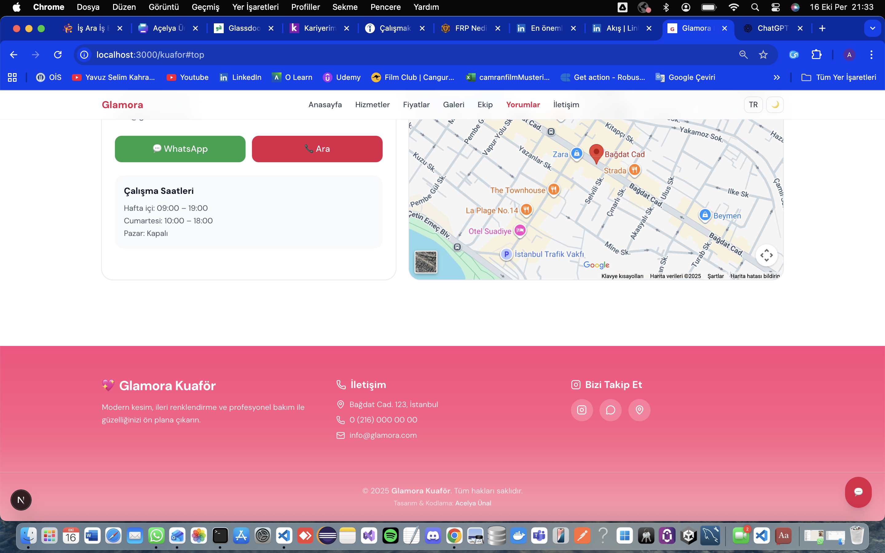
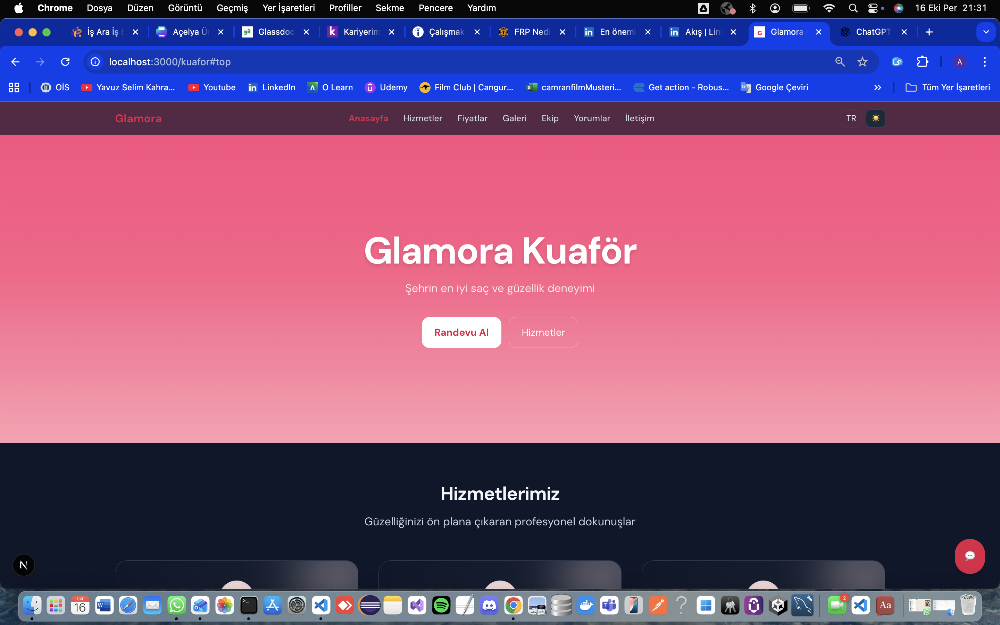

# 💖 Glamora.Web — Kuaför & Güzellik Salonu Web Sitesi

---

### 🌺 Proje Özeti
**Glamora.Web**, modern kuaför ve güzellik salonları için geliştirilmiş, **Next.js + Tailwind CSS** tabanlı çok dilli bir web sitesidir.  
Hedefi, işletmelerin şık, hızlı ve mobil uyumlu bir tanıtım sitesiyle çevrim içi randevu almasını sağlamaktır.  

Bu repo yalnızca **proje vitrini**dir — kaynak kodu özel (private) olarak korunmaktadır.  
Aşağıda proje yapısı, özellikleri ve arayüz görselleri yer almaktadır.

---

### ✨ Öne Çıkan Özellikler

| Alan | Açıklama |
|------|-----------|
| 🌍 **Çok Dilli (TR / EN)** | Türkçe ve İngilizce arayüz, dinamik sözlük sistemiyle. |
| 🌓 **Tema Desteği** | Karanlık ve aydınlık mod arasında tek tıkla geçiş. |
| 💅 **Modern Arayüz** | Tailwind CSS v4 + Framer Motion animasyonları. |
| 💬 **Randevu Formu** | WhatsApp ve EmailJS üzerinden talep gönderimi. |
| 💇‍♀️ **Hizmetler & Fiyatlar** | Kategorilere ayrılmış, şık tablo/kart görünümü. |
| 🖼️ **Galeri & Ekip Bölümü** | Optimize edilmiş görsellerle tanıtım alanları. |
| 💬 **Müşteri Yorumları** | Gerçek kullanıcı değerlendirmelerini sergileyen kartlar. |
| 📱 **Mobil Uyumluluk** | Tüm cihaz boyutlarında tam responsive yapı. |

---

### 🧩 Kullanılan Teknolojiler
- **Next.js 15 (App Router)**
- **TypeScript**
- **Tailwind CSS v4 + PostCSS**
- **Framer Motion** (animasyonlar)
- **Lucide Icons**
- **EmailJS** (form entegrasyonu)
- **LocalStorage** (tema ve dil kaydı)
- **Intersection Observer API** (aktif menü takibi)

---

### 🎨 Arayüz Görselleri

| Bölüm | Ekran Görüntüsü |
|-------|-----------------|
| 🏠 Ana Sayfa |  |
| 💇‍♀️ Hizmetler |  |
| 💰 Fiyat Listesi |  |
| 🖼️ Galeri |  |
| 👥 Ekip |  |
| 💬 Randevu Formu |  |
| 🌙 Karanlık Tema |  |

> Görseller demo amaçlıdır. Kodlar paylaşılmamaktadır.  
> Tüm görseller © Acelya Ünal’a aittir.

---

### 💡 Proje Hedefi
Bu proje, kuaför, güzellik merkezi, spa veya sağlık kliniği gibi işletmelerin profesyonel görünüme sahip bir web sitesine sahip olmasını kolaylaştırmak için geliştirildi.  
Sade yapı, şık animasyonlar ve iki dilli arayüzle modern bir kullanıcı deneyimi sunar.

---

### 📌 Teknik Özellikler
- `App Router` mimarisi (Next.js 15)
- Server Actions (randevu gönderimi)
- `globals.css` içinde Tailwind base & components katmanı
- `src/app/kuafor/KuaforClient.tsx` → tek sayfa, tüm içerik client-side
- Karanlık tema: `html.dark` toggle
- Responsive grid yapısı (`max-w-7xl`, `scroll-mt`, `ring-slate` vb.)
- EmailJS `.env` yapılandırması (`NEXT_PUBLIC_EMAILJS_*`)

---

### 🔒 Lisans ve Kullanım
Bu proje **portföy amaçlıdır**.  
Kaynak kodu özel repoda tutulur ve izinsiz olarak kopyalanamaz veya dağıtılamaz.  
Görseller, tasarım ve marka kimliği **Acelya Ünal**’a aittir.  

> Projeyi incelemek veya referans amacıyla kod erişimi talep etmek isteyenler,  
> [iletişime geçerek](mailto:acelyaunal.dev@gmail.com) özel erişim isteyebilirler.

© 2025 Acelya Ünal — Tüm hakları saklıdır.

---

### 💌 İletişim
📧 **E-posta:** [acelyaunal.dev@gmail.com](mailto:acelyaunal.dev@gmail.com)  
💼 **GitHub:** [github.com/acelyaunal](https://github.com/acelyaunal)  
🌐 **Portfolio:** (isteğe bağlı: kişisel web sitesi linki eklenecekse buraya)  

---

### 🧠 Geliştirici Notu
> “Glamora.Web, küçük işletmelerin profesyonel bir web sitesine sahip olmasını kolaylaştırmak için tasarlandı.  
> Sade yapı, şık animasyonlar ve çok dilli arayüzle modern bir deneyim sunuyor.”  
> — *Acelya Ünal*

---
